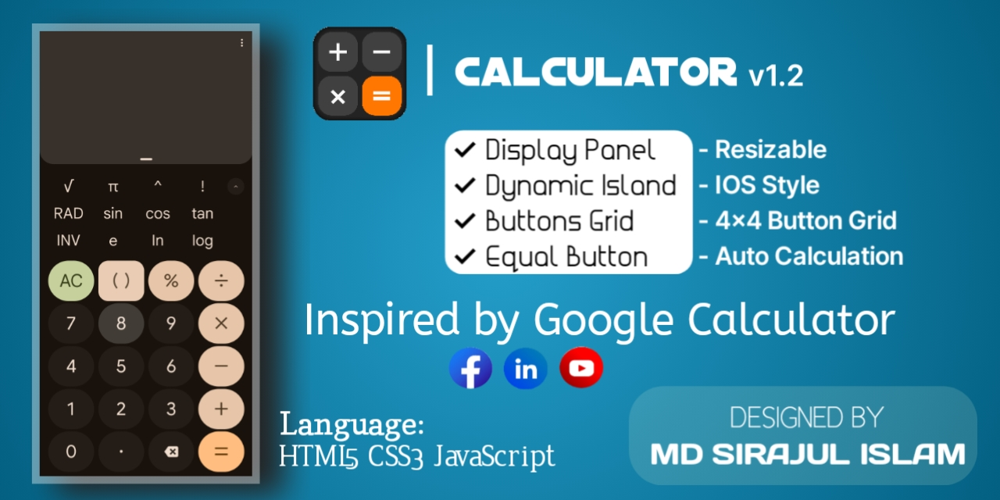

<H1 align="center">
  
    CALCULATOR
  
</H1>

          

---

<h3 align="center"> 🔴Live Preview</h3>

  

<h3 align="center">📲 Download App</h3>

  

---

## ✨ Features

| Feature                          | Description                                                                 |
|----------------------------------|-----------------------------------------------------------------------------|
| ✅ Modern UI                     | Circular transparent buttons, fluid animations, system-based dark/light UI |
| 🔢 Scientific Support            | Includes `sin`, `cos`, `tan`, `√`, brackets, and more                      |
| 🧠 History Log                   | Floating real-time history with click-to-restore capability                |
| 🔘 Copy Result                   | One-click result copy to clipboard                                         |
| ⌨️ Keyboard Friendly             | Keyboard input support with `Enter`, `Backspace`, etc.                     |
| 📱 PWA Enabled                   | Installable as a standalone mobile/web app                                 |
| 📐 Responsive Layout             | Auto fits in **16:9** mobile screens or browser viewports                  |

---

## 🛠️ Technologies Used

- HTML5
- CSS3 (Custom Properties & Media Queries)
- JavaScript (Vanilla)
- [Math.js](https://mathjs.org/) – for advanced expression evaluation
- Progressive Web App support (`manifest.json`, `service-worker.js`)

---

## 🚀 Deployment

This app works seamlessly in:

- Mobile browsers 📱
- Desktop browsers 💻
- As an installable app via PWA 💾

---

## 🧩 Future Improvements (Ideas)

- Voice command input 🎤  
- Unit converter integration 📏  
- Theming options customization 🎨  

---

## 📜 License

This project is licensed under the MIT License.

---
